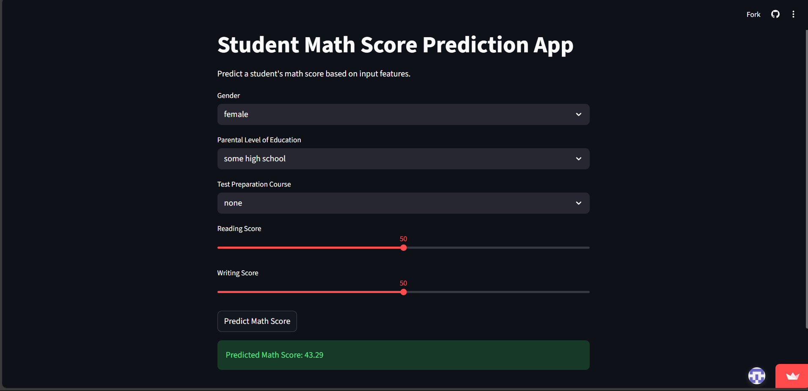

# Student Mark Prediction - Linear Regression

## Project Overview

Student Mark Prediction is a machine learning web application that predicts students' exam scores based on various demographic and academic features. Built with Streamlit and powered by a linear regression model, this project aims to help educators, students, and parents estimate performance and identify areas for improvement.

## Live Demo

👉 **Try the app now:** [Student Mark Prediction Streamlit App](https://studentmarkprediction.streamlit.app/)

## Example Usage

1. Open the app using the link above or run it locally.
2. Enter student details such as gender, parental education, lunch type, test preparation, math score, and reading score.
3. Click **Predict Marks** to see the predicted exam score instantly.

## Features

- 🎯 Simple, interactive web interface
- 📊 Predicts marks using a trained linear regression model
- 📝 Accepts multiple student features as input
- 🚀 Fast, real-time predictions

## How It Works

The app uses a regression model trained on the `StudentsPerformance.csv` dataset. The model considers features like gender, parental level of education, lunch type, test preparation course, math score, and reading score to predict the final marks.

## Conclusion

This project demonstrates the practical application of machine learning in education by providing a simple, accessible tool for predicting student marks. By leveraging real-world data and a user-friendly interface, it empowers users to make data-driven decisions and gain insights into student performance. The approach can be extended or improved with more features, advanced models, or integration into larger educational platforms.

---

